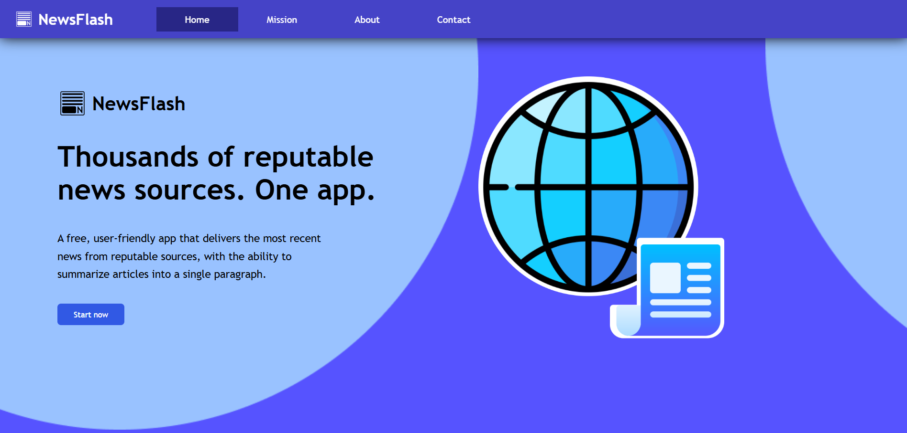
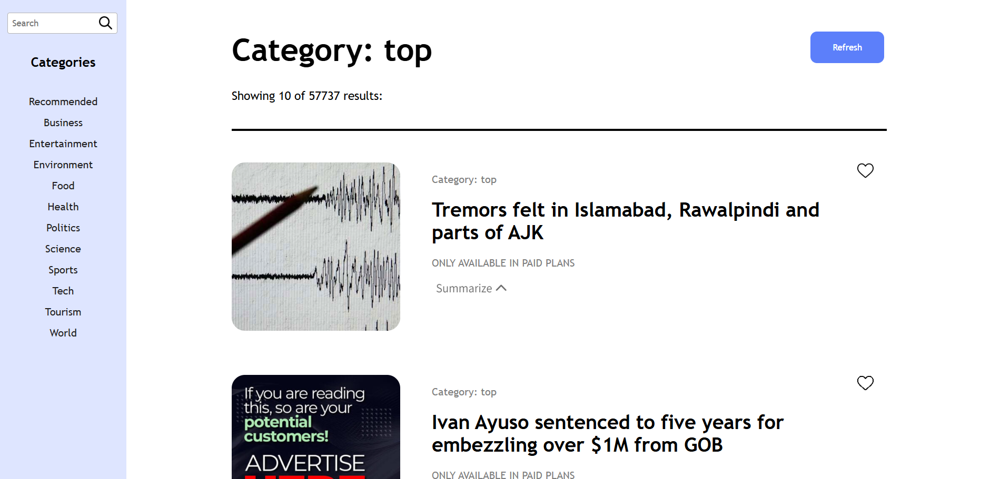

# NewsFlash

Keeping up with the news can be a tedious process. One must scour various news sources and read thousands of words before they are caught up with the latest events. We believe everyone deserves to be well informed - no matter how busy their lifestyle is.
Using NewsFlash, you can read the latest articles from thousands of reputable news sources, and generate **AI summaries** to speed things up. Staying knowledgeable just got a whole lot easier.

**Built with:** ReactJS, CSS, Python, Flask, NewsData API, MeaningCloud API

 

## Description
NewsFlash displays brief overviews of news articles from various sources, sorted by category.
The news articles are displayed as a **paginated** stack of "cards" which display the title and description. Each card includes a "Summarize" button
which expands to display a short **AI-generated summary** of the key points in the article.
Users may **search** for articles by selecting a categtory or by searching for keywords.

## How to build
To build NewsFlash on your own device, clone this repository.
First, run the Python script "main.py" found in the NewsDataIO folder.
Then, open a terminal in the "NewsFlash" folder and write `npm run dev`.

NOTE: MeaningCloud's text summarization API is now only available in paid plans, so pressing the "Summarize" button will only display a warning.
